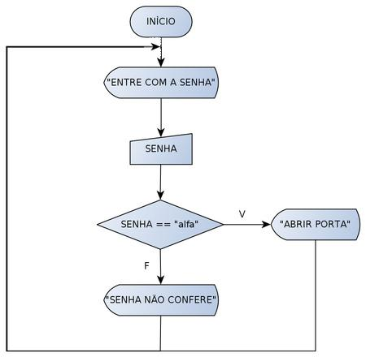

# CursoWebModerno2020
Repositório do curso Web Moderno Completo 2020 - Cod3r/Udemy

### Visão geral de algoritmo

O algoritmo é uma sequência de passos. Essa sequência de passos recebe uma entrada(dados), faz o processamento(algoritmo) e retorna uma saída(resultado/dados).

Existem algoritmos que recebem entradas, porém não retornam saídas.

Existem algoritmos que não recebem entradas, porém geram saídas.

Existem algoritmos que não recebem entrada e não retornam nenhuma saída.

#### Como representar um algoritmo
* Fluxograma

* Linguagem natural
    * Português
    * Ingles
    * Espanhol
* Linguagem artificial
    * C#
    * PHP
    * JavaScript
    * Python
* Pseudo-Linguagem

Não é nem uma linguagem natural e nem uma linguagem artificial, mistura as duas linguagens para ilustrar a sequência do algoritmo.


```
    algoritmo "SomaDoisValores"
    declare
        soma, a, b: inteiro
    inicio
        escreva("digite dois números")
        leia(a,b)
        soma <- a + b
        escreva(soma)

```